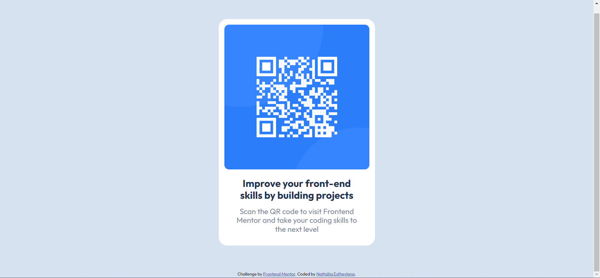

# Frontend Mentor - QR code component solution

This is a solution to the [QR code component challenge on Frontend Mentor](https://www.frontendmentor.io/challenges/qr-code-component-iux_sIO_H). Frontend Mentor challenges help you improve your coding skills by building realistic projects. 

## Table of contents

- [Frontend Mentor - QR code component solution](#frontend-mentor---qr-code-component-solution)
  - [Table of contents](#table-of-contents)
  - [Overview](#overview)
    - [Screenshot](#screenshot)
    - [Links](#links)
  - [My process](#my-process)
    - [Built with](#built-with)
    - [What I learned](#what-i-learned)
  - [Author](#author)

## Overview

This challenge is simple but was amazing for training my HTML and CSS skills.

### Screenshot

### Links

- Solution URL: [Add solution URL here](https://your-solution-url.com)
- Live Site URL: [Add live site URL here](https://your-live-site-url.com)

## My process

Despite this being a simple challenge, I struggled to center the content on the page and make it responsive. I started the challenge by dividing the content into several divs, but after some research I realized that it would be better to use other tags to achieve my goal. This way I could center the content differently, as well as make the code more friendly for screen readers.

### Built with

- Semantic HTML5 markup
- CSS
- Mobile-first workflow

### What I learned

Although I have not learned anything really new, I have had the opportunity to put into practice the mostly theoretical knowledge I have about responsive web design.

## Author

- Linkedin - [Nathália Esthevlana](https://www.linkedin.com/in/nathalia-esthevlana/)
- Frontend Mentor - [@esthevlana](https://www.frontendmentor.io/profile/esthevlana)

